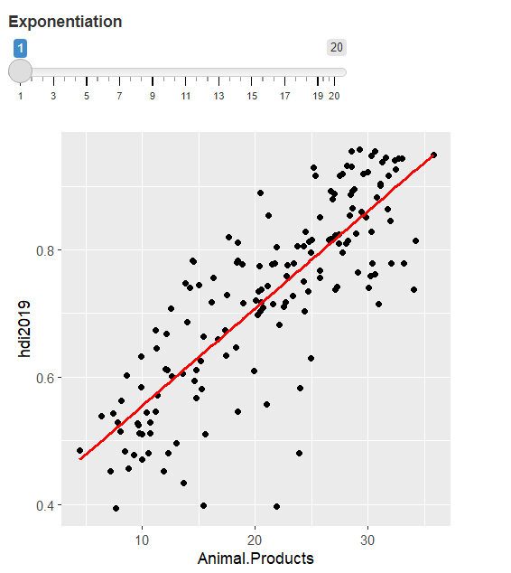

```{r setup, include=FALSE}
library(knitr)
library(tidyverse)
library(reshape2)
library(modelr)

protein<-read.csv("Final_Project/Protein_Supply_Quantity_Data.csv")

quantity_kg<-read.csv("Final_Project/Food_Supply_Quantity_kg_Data.csv")

country <- read.csv("Final_Project/csvData.csv")

colnames(country)<-c("Country","hdi2019","pop2021")
country <- country %>% 
  select(Country,hdi2019,)

pop_density <- read.csv("Final_Project/population_density.csv",check.names = TRUE)
colnames(pop_density)<-c("Country","Density","DensityMi","pop2021","area")

protein_1 <- protein %>% 
  mutate(Death=Deaths/Confirmed) %>% 
  left_join(country,by="Country") %>% 
  mutate(hdi2019_group=hdi2019*10) %>% 
  mutate(hdi2019_group=as.character(hdi2019_group%/%1)) %>% 
  left_join(pop_density,by="Country") %>% 
  rename(no_facet=Unit..all.except.Population.)

quantity_kg_1 <- quantity_kg %>% 
  mutate(Death=Deaths/Confirmed) %>% 
  left_join(country,by="Country") %>% 
  mutate(hdi2019_group=hdi2019*10) %>% 
  mutate(hdi2019_group=as.character(hdi2019_group%/%1)) %>% 
  left_join(pop_density,by="Country")%>% 
  rename(no_facet=Unit..all.except.Population.)

food_5 <- c("Vegetal.Products","Cereals...Excluding.Beer","Animal.Products","Milk...Excluding.Butter","Meat")
rank_5 <- 1:5

protein_food <- protein %>% 
  select(Country:Miscellaneous)

quantity_kg_food <- quantity_kg %>% 
  select(Country:Vegetal.Products)


protein_food_samples <- melt(protein_food,id="Country")
protein_food_samples <- protein_food_samples%>% 
  rename(Food=variable) %>% 
  arrange(Country,desc(value)) %>% 
  mutate(Confirmed=rep(protein$Confirmed, each=23)) %>% 
  mutate(Death=rep(protein$Death, each=23)) %>%
  arrange(desc(Confirmed),Country,desc(value)) %>% 
  mutate(rank=(c(1:nrow(protein_food_samples))-1)%%23+1)


quantity_kg_food_samples <- melt(quantity_kg_food,id="Country")
quantity_kg_food_samples <- quantity_kg_food_samples%>% 
  rename(Food=variable) %>% 
  arrange(Country,desc(value)) %>% 
  mutate(Confirmed=rep(quantity_kg$Confirmed, each=23)) %>% 
  mutate(Death=rep(quantity_kg$Death, each=23)) %>%
  arrange(desc(Confirmed),Country,desc(value)) %>% 
  mutate(rank=(c(1:nrow(quantity_kg_food_samples))-1)%%23+1)
         

knitr::opts_chunk$set(echo = FALSE)
```

# Abstract
We try to find some relationship between how much percentage of protein we get from different kinds of food and COVID-19 cases, hoping to find a way to fight against COVID-19 different from using medicine, and finding a good daily diet to fight against COVID-19. We analyzed COVID-19 confirmed and death cases on some typical types of food and added extra variable "Human Development Index"(HDI). We summarized what we get and some problems during the whole process. Finally, we cannot get true relationship between COVID-19 and protein intake from different food that can be proved, even with the help of Human Development Index.


# Introduction
Based on the current pandemic, and we recently read an articular about about Protein provision and lower mortality. we hope to do something to help the people who suffering from the pandemic. Since, under certain circumstances, protein intake is beneficial in reducing patient mortality ([Silvah, 2021](https://www.ncbi.nlm.nih.gov/pmc/articles/PMC8282450/pdf/main.pdf)). Improving protein intake in daily life is also likely to have a beneficial effect on disease prevention.

Firstly, by ordering confirmed rate of all countries, and compared their percentage of protein intake from different food, we find some potential food that may have relationship with COVID-19

Then, when we find we cannot get relationship simply from those food, we added a new variable Human Development Index(HDI) to remove its influence as much as possible.

After we find we still cannot find what we want, we move target to death cases, as we find death cases can be more related to our background. As we mentioned, there is proved research about protein intake and ICU rate.

Further more, we also used another data set, which contain food supply in quantity by kilogram in different countries. The reason for that is we think percentage of protein from different food may not make sense. Suppose in some country, people cannot get protein except a little meat. The quantity of meat may be low, but percentage of protein from meat can be very high.

After we have done all analysis, although we controlled development index, we still cannot prove there is relationship between how much percentage of protein we get from different kinds of food and COVID-19 cases. 


# Dataset
Protein supply data set contains 170 rows and 32 columns. the 170 rows means 170 kinds of country and 32 means the types of sources where we can get protein from daily diet. There are also some Indicators like confirmed deaths recovered and so on. This data set obtain the percentage of total white matter intake per food egg; total population; name of country; mortality rate, diagnosis rate, recovery rate.


  **[COVID-19 Healthy Diet Dataset](https://www.kaggle.com/mariaren/covid19-healthy-diet-dataset)**

Food quantity supply data set is similar to protein supply data set. Difference is all values of different food  indicate how many kilogram people have for that kind of food.

**[Human Development Index(HDI)](https://worldpopulationreview.com/country-rankings/hdi-by-country)** data set shows us how developed a country is. Higher HDI means the country is more developed.


# Method of analysis
- Since in original data set, different types of food ar in different columns, which is not convenient for us to filter or group data,so we transform to a new data frame where we have variable Food and values(percentage or quantity). Then it is easier to look for potential food that can have relationship. Besides, left_join() is used to combine our data sets, helping us analyse data. 

- Control variable is the key idea in our final research, by group different HDI, we can look for relationship in different HDI level, which in another word we almost removed the influence of HDI.


- We used basic polynomial model whose exponentiation from 1 to 20 to fit the data.Our purpose is to check if theere is brief model that can fit our data.

# Results
Since we ordered by confirmed from low to high, we can select from different food below. We can find "Animal Products","Milk","Meat" can have potential relationship

{out.width=50%,out.height=50%}


{out.width=30%,out.height=30%}

Then, we just take animal products as an example. We tried to use polynomial model with different exponentiation, it is clearly that we cannot find a model that can fit out plot,as the plot looks more like an area rather than a line. HDI could have relationship with upper boundary of confirmed rate, but definitely not with confirmed rate
{out.width=50%,out.height=50%}
{out.width=50%,out.height=50%}

However, if we add color which indicates different HDI group from 1 to 9, we can find our scatter points have different layers with different color when the percentage of protein we get from animal products getting larger. So, when tried to make a model for it, simple linear model can fit our data in the plot below.

{out.width=50%,out.height=50%}
{out.width=50%,out.height=50%}

Return to our previous model, if we set facet images by different HDI group, we can analysis our relationship separately, which almost remove the influence of HDI.However, we found in less-developing countries(HDI<=6, especially HDI<=5), COVID-19 confirmed rate always keep in a very low value, which looks abnormal. We cannot come up with any reasonable ideas about it. We think maybe other factors like population density plat an important role in it. that actually is not our target this time, but can be our potential future work.

Based on our background, we find death rate can be more suitable target after we did not get what we want from previous work. So, we can get us similar methods as before. After selecting related input and got new plot we have some new this time.  

- For less-developing countries(HDI<=5), it seems there is some relationships.  
- For highly developed countries(HDI=9), all points come together, while when HDI getting less, points getting scattered.

For the former, we do want to make it as our new finding. However, no matter how we analyse, what we have can be just guessing. Additionally, the number of these countries is so small, so we did not model for that.

For latter, in highly developed countries, level of medical system may play a important role. Even if it is also just guessing, we have more countries this time, and for those countries the percentage of they do not have a good medical system is so low, so it is actually more reasonable guessing compared with the former.

We also did similar research steps on data about food supply quantity, but we did not find some new, so, we do not show the results about them this time.

{out.width=50%,out.height=50%}
{out.width=50%,out.height=50%}


# Conclusion and discussion
Based on our result, we do found some relationship between HDI and food, which makes sense. For example, usually people have more animal products, and they get more protein from animal products. The relationship between HDI and COVID-19 is not so clear, even we found in highly developed countries, death rate is relatively lower and has less difference. As for relationship between how much percentage of protein we get from different kinds of food and COVID-19 cases, we do not have evidence to prove it. However, even if we do find relationship between both HDI-food and HDI-COVID-19, our target still cannot be proved by simple Mathematics. The HDI can actually indicates many different things, it can have relationships with medical system, personal income, living environment. Each of them are not simple linear relationship, and some them even hard to evaluate by some values. In addition, control one variable cannot find actual relationship between protein get from food either. So, many different and complex reasons makes us did not figure out our problems in this projects.


# Reference
- Silvah, J., De Lima, C., Nicoletti, C., Barbosa, A., Junqueira, G., Da Cunha, S., & Marchini, J. (2021). Protein provision and lower mortality in critically ill patients with COVID-19. *Clinical Nutrition ESPEN,* *45*, 507-510.


